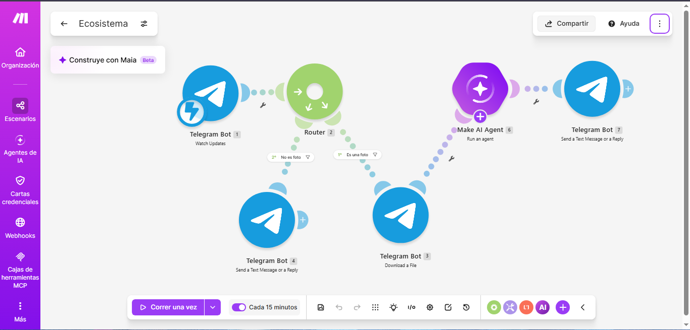
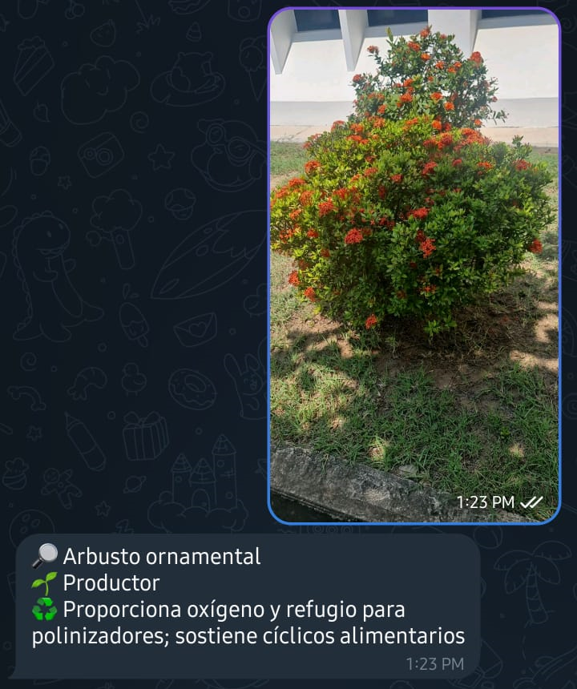

# Ecosistema — Bot de Telegram con IA en Make

**Materia:** Desarrollo Sustentable · **Tema:** El Ecosistema
**Autor:** Roberto Carlos Robles Campos

## 1. Descripción

Automatización construida en Make.com que permite a un estudiante tomar
una foto de un ser vivo del jardín del Tecnológico, enviarla a un bot de
Telegram (`@Ecosistema13_bot`) y recibir de vuelta, en segundos:

- 🔎 el nombre probable del organismo,
- 🌱 su clasificación (Productor / Consumidor / Descomponedor),
- ♻️ su rol en el ecosistema (máximo 15 palabras).

Si el mensaje no trae una foto, el bot le pide al usuario que envíe una.

## 2. Objetivos

- Recibir mensajes de Telegram en tiempo real mediante un webhook.
- Separar el flujo según el tipo de mensaje usando un **Router con filtros**.
- Descargar la foto enviada y analizarla con un **agente de IA** con instrucciones (prompt de sistema) propias.
- Responder automáticamente al usuario por Telegram.

## 3. Arquitectura del escenario



Prueba en Telegram: una foto recibe una sola respuesta con el análisis.



```
Telegram: Watch Updates
        │
     Router
   ┌────┴──────────────────────────┐
   │ Filtro "Es una foto"          │ Filtro "No es foto"
   │ (message.photo existe)        │ (message.photo no existe)
   ▼                               ▼
Telegram: Download a File     Telegram: Send a Reply
   ▼                          ("Envíame una foto...")
AI Agent: Run an agent
   ▼
Telegram: Send a Reply
```

| # | Módulo | Función |
|---|---|---|
| 1 | Telegram Bot — Watch Updates | Disparador: recibe cada mensaje enviado al bot |
| 2 | Router | Divide el flujo en dos rutas |
| 3 | Telegram Bot — Download a File | Descarga la foto (`message.photo[].file_id`) |
| 6 | Make AI Agents — Run an agent | Identifica el organismo siguiendo el prompt de sistema |
| 7 | Telegram Bot — Send a Reply | Envía al usuario la respuesta del agente (`6.response`) |
| 4 | Telegram Bot — Send a Reply | Ruta alterna: pide al usuario que envíe una foto |

### Filtros del Router

| Ruta | Nombre del filtro | Condición |
|---|---|---|
| 1 (análisis) | Es una foto | `{{1.message.photo}}` **Exists** |
| 2 (aviso) | No es foto | `{{1.message.photo}}` **Does not exist** |

Sin estos filtros ambas rutas se ejecutaban a la vez: una foto disparaba
el análisis **y** el mensaje "Envíame una foto", y un mensaje de solo
texto hacía fallar la ruta de análisis (no hay archivo que descargar).

## 4. Prompt del agente de IA

El agente recibe la foto y responde siempre con este formato, máximo 35
palabras y en español:

```
🔎 [nombre probable del organismo]
🌱 [Productor / Consumidor / Descomponedor]
♻️ [rol en el ecosistema en máximo 15 palabras]
```

Si la imagen no muestra un ser vivo, responde: *"❌ No identifico un
organismo. Intenta con una planta, insecto u otro ser vivo."*

## 5. Cómo reproducirlo

1. Crear un bot con **@BotFather** en Telegram y guardar el token.
2. En Make, importar [`codigo/blueprint.json`](codigo/blueprint.json)
   (Scenario → `...` → *Import Blueprint*).
3. Crear la conexión de **Telegram Bot** con tu token y asignarla a los
   módulos de Telegram.
4. Asignar tu proveedor de IA en el módulo *Run an agent*.
5. Activar el escenario (**ON**) y escribirle una foto al bot.

## 6. Preguntas de reflexión

**¿Qué papel cumple el Router y por qué fueron necesarios los filtros?**
El Router permite que un mismo disparador tenga caminos distintos. Sin
filtros, Make ejecuta todas las rutas; con ellos, cada mensaje sigue
solo la ruta que le corresponde (foto → análisis, texto → aviso).

**¿Qué ventaja ofrece la IA frente a una lista fija de organismos?**
Puede identificar organismos que no se programaron de antemano y
explicar su rol ecológico con el mismo formato, sin mantener una base de
datos.

**¿Qué limitaciones tiene el sistema?**
La identificación es "probable", no garantizada: depende de la calidad
de la foto y del modelo, y siempre debe verificarse con una fuente
confiable. Además, cada análisis consume operaciones y créditos de IA
en Make.

**¿Cómo se relaciona con el desarrollo sustentable?**
Acerca a los estudiantes al reconocimiento de productores, consumidores
y descomponedores de su entorno, fomentando el conocimiento y el cuidado
de la biodiversidad local mediante tecnología de bajo costo.

## 7. Estructura del repositorio

```
├── README.md
├── codigo/
│   └── blueprint.json
├── imagenes/            capturas del escenario completo con filtros
├── video/
│   └── enlace.txt       enlace a la prueba en vivo (YouTube)
└── resultados/
    └── Resultados.pdf   lo aprendido en esta práctica
```
